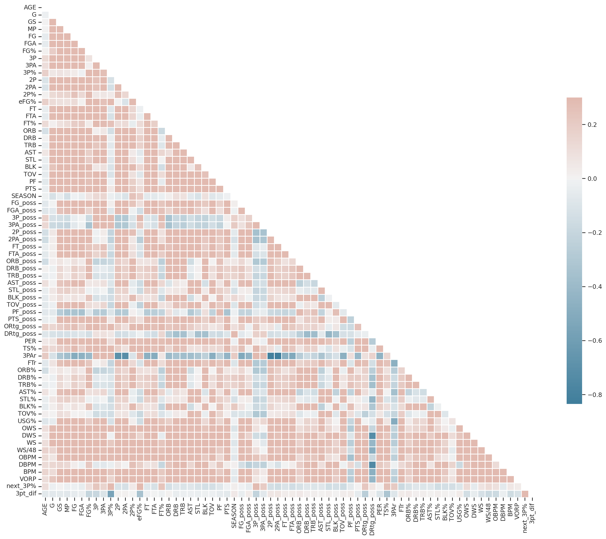

# Projecting NBA 3PT Shooting

NBA 3PT shooting is a vital aspect of any NBA team's offense. Besides the obvious advantage of giving your team more points than a 2pt shot, 3PT shots allow teams to stretch the floor. With several high-percentage shooters around the perimeter, there is more room on the interior for players with the ball to operate and find efficient shots. The best rim protectors, like Rudy Gobert, must decide between leaving open deadly shooters or abandoning the interior, or paint, where they provide the most value.

With 3PT shooting being so valuable, being able to predict shooting development from year to year is quite important. Shooting performance from year to year can vary greatly, however. Understanding the factors that can predict a player's shooting in the next season would be quite beneficial for constructing a team. Contract decisions in free-agency, extension talks, or trade negotiations would greatly benefit from the knowledge that a player is likely to perform better, or perhaps worse, in the upcoming season. 

## Data

This data was acquired from [Basketball Reference](https://www.basketball-reference.com/) using [basketball_reference_scraper](https://github.com/vishaalagartha/basketball_reference_scraper). This scraper allows access to individual player statistics, including advanced stats, in various forms. For this analysis, I take advantage of player stats in the following forms: advanced, per 100 possessions, and season totals. The per possession data is particularly important, as it normalizes player stats so that players of various roles and minute totals can be compared on a more even playing field.

One modification made to the aformentioned scraper involves importing player names. The base scraper has issues with accented letters from certain sources. To make sure some name get imported, the function `remove_accents()` attempts to match the name to names from a source that imports names more cleanly. However, the original matching algorithm often finds the incorrect match, often picking a seemingly random name from the roster. My modified function greatly reduces the probability of mismatches. 

This analysis uses Basketball Reference data from all 30 teams from the 2009-2010 to the 2020-2021 season, retrieving advanced, per 100 possession, and season total stats. The scraper takes quite a bit of time to run to retrieve all of the desired data, potentially over an hour. The raw data was stored as in the `data/` directory in three .csv files: `allplayer_poss.csv`, `allplayer_adv.csv`, and `allplayer_tot.csv`.

 ## Preprocessing

Once the data has been read in, the data must be treated in order to be used for analysis. Several columns are removed that contain no data, as are features that are present across the three data frames. The data frames are then combined, and features with the same names but with different meanings are renamed. Primarily this includes the per 100 possession features, the season totals of which are present in the totals data frame.

The largest preprocessing hurdle is accounting for players who were members of multiple teams in a given season. This can occur if a player was traded, or if their contracted was waived, and they were re-signed to a different team. For each team a player was on in a given season, the scraper returns one row of data. Every player-season combination that is listed more than once in the data frame was combined to be a single row. The season total statistics were simply added together across the various samples for each listing. For per possession stats, as data on the total number of possessions was unavailable, the final per possession stats were calculated as a weighted average of the games played for each team that season. 

As the targets for this analysis are the next season's 3PT percentage, any player seasons with fewer than 100 3PT attempts were removed, as more attempts are needed for the percentage to stabilize. For the 1768 player seasons remaining, each was checked to see the upcoming season for that player had also met the 100 3PT attempts criterion. If it did, then the upcoming season's 3PT percentage was then added as the target feature. 

## Data Visualization

 

### Feature Distributions

The target feature is displayed here as a proportion, though it will still be referred to as a percentage by convention. You can see it is approximately normally distributed. The mean of the distribution is at 0.361, and it has a standard deviation of 0.0418.

 

The distributions of each of the features was also visualized. A few were selected here to show. Some features are normally distributed, such as FG%, which is the percentage of field goals attempted that were successfully made. Others exhibit skew, such as FGA or field goal attempts, the total number of shot attempts in a season. A number of skewed features also contain both positive and negative values, the example being OBPM, or offensive box plus-minus, a metric trying to ascertain player offensive value.

 

 

For this reason, the features were treated with cube root transformation. This allows more automated transformation, as log transforming data with negative values requires adding some constant to all values. Below, the effect of the transformations on the non-normal variables FGA and OBPM are displayed. FGA is relatively normal now. OBPM has less skew, but the shape of the distribution is still not entirely normal. To see all of the untransformed and transformed distributions, please view `code/python/analysis/visualize.ipynb`.

 

 

### Correlations
In order to have predictive power, several features need to have reasonably high correlation with the target feature. Here, I plot the 5 features with the highest Pearson's R with the next season's shooting percentage: free throw shooting percentage (FT%), 3PT attempts per 100 possessions (3P_poss), 3PT shooting percentage (3PT%), effective field goal percentage (eFG%), and true-shooting percentage (TS%). eFG% and TS% are different composite methods to estimate overall shooting aptitude that take into account the increased value of 3PT shots. TS% also takes free-throw shooting into account.

 

 

None of these individual features are strongly correlated with the target feature, so it is unlikely that any model formed from these data will predict next season's shooting with particularly high accuracy. However, these features providing the most information about the target makes a great deal of sense. One would expect one season's shooting to be somewhat predictive of the next season's shooting. Similarly, FT% is commonly used to project the 3PT shooting of NBA draft prospects, as many pre-NBA players do not shoot enough 3PT shots to have a reasonable sample size. The number of 3PT shots taken per 100 possessions having some predictive power is also reasonable, as the best shooters tend to take more shots from 3PT range.

Here, the correlation between all features is also displayed. Many features are slightly positively correlated with each other. 3PT attempt rate (3PAr, the percentage of field goals taken from 3) is strongly negatively associated with several features, as is defensive rating (DRtg_poss).

 

 
 
## Analysis

To predict player 3PT shooting in the upcoming season using current season data transformed above, I implemented several machine learning algorithms from the `scikit-learn` library. The custom `utils` module contains several functions imported here, such as `utils.read_data()`, which takes the path to the transformed or untransformed data and returns the features and the target, as well as the original data frame. 

After splitting the data into training and test sets, each of the models is trained using the `utils.model_train()` function. This function takes several arguments, including a `scikit-learn` model, training features, training response variable, and a preprocessing `scikit-learn` `Pipeline`. This preprocessing `Pipeline` is created with `utils.pipeline()`, which creates transformers for both numerical and categorical variables. Numerical variables undergo mean imputation and standardization to set the mean of the feature to zero and give it unit variance. Categorical features undergo one-hot encoding. Training data is fit and transformed with this pipeline. `utils.model_train()` can also perform hyperparameter tuning if a parameter grid is provided. To score the model, `utils.scores()` is invoked, which prints out the following regression scores: $R^2$, mean squared error (MSE), and mean absolute error (MAE). 

*Table 1: Test scores for various models.*
| Model          | Test $R^2$ | Test MSE | Test MAE |
|----------------|------------|----------|----------|
| Dummy          | 0.000      | 0.00182  | 0.0331   |
| OLS            | 0.098      | 0.00149  | 0.0305   |
| Ridge          | 0.158      | 0.00139  | 0.0293   |
| Random Forest  | 0.175      | 0.00136  | 0.0293   |
| Neural Network | 0.153      | 0.00150  | 0.0302   |

### Dummy Model
To compare MSE and MAE values to a baseline, I implemented a `DummyRegressor()`, which simply returns the mean target value for every sample. This returned a test MSE of 0.018 and a MAE of 0.033 (or 3.3%). These values will be used as the threshold for other models here. 

*Table 1: Test scores on various models.*

### Linear Models

Both simple OLS regression and ridge regression were implemented for linear models. Of all the models implemented, OLS had the worse performance with an $R^2$, an MSE of 0.00149 and an MAE of 0.0305. Adding in L2 regularization with a ridge model improves the performance. Hyperparameter tuning was used to improve performance by setting the regularization term `alpha` to ~233.6, fitting the intercept as a bias term, and using the `saga` solver, returning an $R^2$ of 0.158, an MSE of 0.00139, and a MAE of 0.0293. This shows that regularization is beneficial to improving model performance. 

The ridge model shows that the most important features for predicting the next season's 3PT shooting are largely in line with the Pearson's R values described above. FT% and 3P% are the best predictors. Many stats that attempt to measure total player value are also positive indicators, such as offensive win shares (OWS) and box plus-minus (BPM). This would indicate that the better the player, the more likely shooting improvement is. Free-throw rate (FTr) and games played (G) are negatively associated with the target. These are more difficult to explain. One possible explanation is that higher FTr would imply that a player takes a smaller proportion of shots from 3PT range. 

The team a player is on may also have some effect. Golden State and San Antonio players are more likely to have higher 3P%, while Oklahoma City and Atlanta players are more likely to have lower 3P%. These team-based effects may not be predictive in future years, however, as team staffs and rosters turnover. 

 

### Random Forest

To see if ensemble methods would improve performance, I implemented a random forest regression model. Splits were determined by minimizing squared error. Hyperparameter tuning selected the following parameters: max tree depth of 1067, max features used in a split set to the square root of the total number of features, minimum samples per leaf of 1, minimum samples per split of 2, and the number of trees in the forest was set to 916. This model received an $R^2$ of 0.175, an improvement over ridge. However, the metrics are more comparable to the ridge model, with a MSE of 0.00136, and a MAE of 0.0293. 

The top features from the random forest are slightly more inline with the correlation values compared to the ridge model, with the top 5 features being the same as the top 5 Pearson's R values. Here, 3P% is the most important feature. Unlike the ridge model, the top features of random forest do not include any specific teams or composite metrics trying to measure player value. 

 

### Neural Network

I also implemented a neural network with `tensorflow` and `keras`. This used `keras.models.Sequential` to create a model with several hidden layers and dropout between layer. Each node was initialized with the `relu` activation function. The Adam optimizer was used with mean standard error to optimize the model for 500 epochs with early stopping enabled. The learning rate was set to 0.001. This model is outperformed by the linear and random forest models receiving an $R^2$ of 0.153, an MSE of 0.00150, and a MAE of 0.0302. This relatively poorer performance is likely due to a relatively small sample size (~1750).

## Conclusions

If predicting player 3PT percentage from raw statistics was easy, NBA scouts and talent evaluators would be out of a job. Thankfully for them, there are many factors that play into player development, many of which are not accounted for in the Basketball Reference database. These include both tangible quantities like player measurements, injury histories, time put into personal improvement and shooting performance in practice, as well as intangible qualities, such as player personality and drive, shooting form, and the quality of trainers and coaching staff members. Finally, it must be acknowledged that even NBA front offices who have all of this information at their disposal have difficulty projecting the shooting ability of many of their players. 

While these models cannot predict future shooting with great accuracy, they do provide insight into what the best predictors are. 3P% as a top predictor is very reasonable, as shooting should stay somewhat similar from year to year. Free throw shooting percentage and form are often used to evaluate potential 3PT shooting in prospects, so it is also reasonable it is a strong predictor here. 3PT shooting is a rather noisy statistic with a large degree of variance from year to year, but this analysis provides a basic quantitative frame work for inferring future performance. 